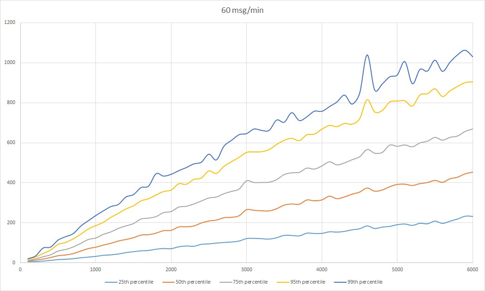
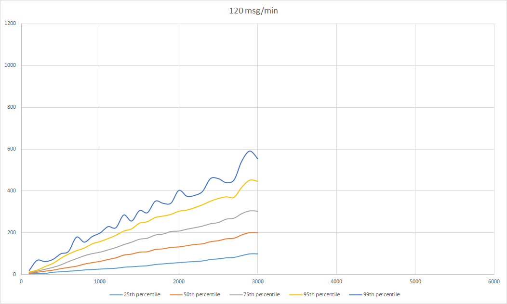

# Performance

## Server setup

This is the load test of BitSocket running on low cost (1$ per month) virtual server having following configuration:

- VMware hypervisor
- CPU: 1 vCore
- RAM: 1 GB

## Results

First test publishes 1 message per second. Each two minutes, 100 new clients are connected. **Message delivery latency** is computed as the difference between time of message publication (measured prior to endpoint call) and message receipt by client. Following graph shows latency statistics per count of clients.

Second test doubles the message rate. Statistics are nearly identical until 3000 clients where throughput cap for given server configuration is reached.

Network latencies are not included.