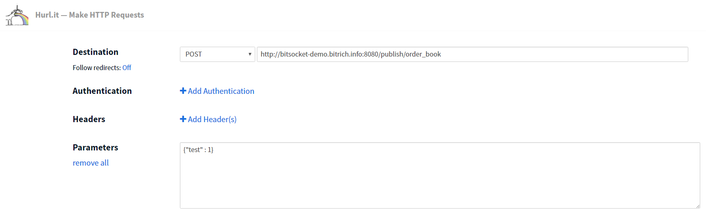

# Try demo using on-line tools

You can feel our demo using on-line tools without need to hack anything.

1. Open our simple [WebSocket javascript client](http://bitsocket-demo.bitrich.info/ws-client.html). You can open it multiple times.
2. Open some [on-line REST client](https://www.hurl.it/).
3. Send `POST` to

        http://bitsocket-demo.bitrich.info:8080/publish/order_book
   
   with some body
   
        {"test": 1}
        
   As you can see on the following screenshot.
   
   
		
4. See message delivered in browser tabs with WebSocket client.